# FallGuard AI
### Smartphone-Based Real-Time AI Fall Detection and Human Activity Monitoring System

[](https://fastapi.tiangolo.com)
[](https://scikit-learn.org)
[](https://www.python.org)
[-3DDC84.svg?logo=android)](https://developer.android.com)
[]()
[]()

> **The smartphone acts as the physical sensing device.**  
> FallGuard AI transforms standard off-the-shelf user smartphones into clinical-grade continuous fall detection and activity recognition monitors. The smartphone streams live 6-axis kinematics over an authenticated, persistent WebSocket connection into FastAPI, maintaining a strict 5-second transient rolling buffer in memory, executing 128-sample sliding window ML inference, providing two-tier user confirmation ("I'm OK" false-alarm mitigation), and escalating confirmed emergencies to designated contacts.

---

## 1. System Architecture

```mermaid
flowchart TD
    subgraph SENSING["1. Physical Sensing Hardware (User Smartphone)"]
        SP[Android Smartphone]
        ACC["Sensor.TYPE_ACCELEROMETER (ax, ay, az in m/s²) @ 50 Hz"]
        GYRO["Sensor.TYPE_GYROSCOPE (gx, gy, gz in rad/s) @ 50 Hz"]
        LOC["Optional Emergency GPS (Lat, Lon)"]
        MC["Mobile Sensor Collector\n(Foreground Service + Notification)"]
        PHONE_BUF["Bounded 5-Second Local Buffer (max 250 samples)"]

        SP --> ACC & GYRO
        ACC & GYRO --> MC
        MC --> PHONE_BUF
    end

    subgraph TRANSPORT["2. Live Persistent Connection"]
        WS_STREAM["Authenticated Persistent WebSocket\n(ws://backend:8000/ws/sensor?token=JWT)"]
        PHONE_BUF --> WS_STREAM
    end

    subgraph BACKEND["3. FastAPI Backend Ingestion & Windowing"]
        FA[FastAPI Telemetry Ingest]
        NORM["Unit Normalization Layer\n(ax_g = ax / 9.80665)"]
        RING["DeviceSensorBuffer\nStrict 5-Second In-Memory Ring Buffer (max 250 samples)\nZero permanent database accumulation"]
        ISOLATION["Multi-User / Multi-Device Isolation"]
        STRIDE["Sliding Window Slicer\n(128 samples / 2.56s window, 25 samples / 0.5s stride)"]

        WS_STREAM --> FA
        FA --> NORM
        NORM --> RING
        RING --> ISOLATION
        ISOLATION --> STRIDE
    end

    subgraph ML_PIPELINE["4. Feature Engineering & Trained ML Model"]
        FEAT["60+ Multi-Domain Features\n(RMS, FFT Energy/Entropy, Jerk, Angular Acc, Tilt)"]
        MODEL["Trained Classifier (Logistic Regression / Ensemble)\nFall Recall: 100%, Accuracy: 92.1%"]
        SCREENING["Two-Stage Decision Engine\n(Transparent ML Probability vs. Safety Override)"]

        STRIDE --> FEAT
        FEAT --> MODEL
        MODEL --> SCREENING
    end

    subgraph CONFIRMATION["5. False Alarm Mitigation & Confirmation Lifecycle"]
        POTENTIAL["Potential Fall Detected (High Risk)"]
        PROMPT["Smartphone High-Priority Notification & Dialog\n(Vibration + 15s Countdown Timer)"]
        CHOICE{"User Action?"}
        SAFE["User presses 'I'M OK'\n-> Cancel Alert (False Alarm, No Contact Notified)"]
        ESCALATE["User presses 'NEED HELP' or 15s Timeout Expires\n-> Fall Confirmed!"]

        SCREENING -->|is_fall = true| POTENTIAL
        POTENTIAL --> PROMPT
        PROMPT --> CHOICE
        CHOICE -->|I'm OK| SAFE
        CHOICE -->|Need Help / Timeout| ESCALATE
    end

    subgraph ESCALATION["6. Emergency Dispatch & Dashboard"]
        EVENT["Persistent FallEvent Record\n(Timestamp, Contact Snapshot, Risk, GPS Coordinates)"]
        ALERT_SVC["Emergency Provider Abstraction\n(Mock Provider / Twilio SMS Provider)"]
        CONTACT["Emergency Contact (Phone / SMS)"]
        DASH["Live Healthcare Dashboard\n(/ws/monitor & Web UI)"]

        ESCALATE --> EVENT
        EVENT --> ALERT_SVC
        ALERT_SVC --> CONTACT
        SAFE -.-> DASH
        ESCALATE -.-> DASH
        FA -.->|25Hz SENSOR_TICK| DASH
    end
```



---

## 2. Core Principles & Key Innovations

### Strict Five-Second Raw Data Retention Guarantee
In strict compliance with user privacy and high-performance constraints:
- **Raw accelerometer and gyroscope samples are NEVER continuously stored in any database table.**
- The backend maintains an in-memory `DeviceSensorBuffer` utilizing an ephemeral circular ring buffer (`deque(maxlen=250)`).
- At $50\text{ Hz}$, $5\text{ seconds} \times 50\text{ samples/sec} = 250\text{ samples}$. When sample 251 arrives, sample 1 is automatically discarded.
- Only aggregated **FallEvents** (incidents, triage decisions, and confirmation status) are persisted.

### Unit Normalization Layer
The trained ML pipeline (trained on UCI HAR and SisFall kinematics) expects:
- Acceleration in **`g`** ($1g \approx 9.80665\text{ m/s}^2$)
- Gyroscope in **`rad/s`**

Android devices output accelerometer readings natively in $\text{m/s}^2$ and gyroscope in $\text{rad/s}$. The backend implements an explicit unit normalization layer on ingest:
$$a_g = \frac{a_{\text{m/s}^2}}{9.80665}$$
This prevents stationary gravity ($9.81\text{ m/s}^2$) from falsely triggering the $2.8g$ impact threshold.

### Transparent Fall Decision Logic
The ML inference engine explicitly disambiguates pure model probability from safety heuristics:
```json
{
  "activity": "FALL",
  "ml_activity": "WALKING_DOWNSTAIRS",
  "ml_fall_probability": 0.31,
  "safety_override": true,
  "is_fall": true,
  "confidence": 0.94,
  "risk_level": "HIGH"
}
```

### Two-Tier Fall Confirmation (False Alarm Prevention)
A high-impact spike does not immediately contact emergency services:
1. When a potential fall is detected, status becomes `PENDING_CONFIRMATION`.
2. The phone triggers a high-priority, screen-waking alert with haptic vibration and a configurable 15-second countdown.
3. If the user presses **[I'M OK]**, the alert is marked `CANCELLED_BY_USER`. **No emergency contact is alerted.**
4. If the user presses **[NEED HELP]** or the timeout expires without response, the incident becomes `CONFIRMED`, and an emergency alert is dispatched to the user's emergency contact with optional GPS coordinates.

---

## 3. WebSocket Protocol Specification

### A. Smartphone Sensor Ingestion (`/ws/sensor`)
**Endpoint**: `ws://<host>:8000/ws/sensor?token=<JWT_TOKEN>&device_id=<DEVICE_ID>`

#### 1. Handshake Response (Server -> Phone)
```json
{
  "type": "auth_success",
  "device_id": "phone_pixel8_01",
  "user_id": 6,
  "user_name": "Eleanor Vance",
  "expected_sampling_rate": 50.0,
  "window_samples": 128,
  "max_buffer_samples": 250,
  "buffer_duration_seconds": 5.0,
  "confirmation_timeout_seconds": 15.0
}
```

#### 2. Live Sensor Telemetry (Phone -> Server at 50 Hz)
```json
{
  "type": "sensor_data",
  "version": 1,
  "device_id": "phone_pixel8_01",
  "timestamp": 1730000000.123,
  "unit": "m/s2",
  "accelerometer": {
    "x": 0.12,
    "y": 0.35,
    "z": 9.81
  },
  "gyroscope": {
    "x": 0.02,
    "y": -0.01,
    "z": 0.04
  },
  "location": {
    "lat": 37.7749,
    "lon": -122.4194
  }
}
```

#### 3. Fall Pending Confirmation Prompt (Server -> Phone)
```json
{
  "type": "FALL_PENDING_CONFIRMATION",
  "event": {
    "id": 42,
    "event_id": 42,
    "device_id": "phone_pixel8_01",
    "timestamp": "2026-09-07T19:50:00Z",
    "confidence": 0.96,
    "risk_level": "HIGH",
    "timeout_seconds": 15.0,
    "safety_override": true,
    "ml_activity": "WALKING",
    "message": "Possible fall detected. Are you okay?"
  }
}
```

#### 4. Fall Confirmation Response (Phone -> Server)
```json
{
  "type": "fall_confirmation",
  "event_id": 42,
  "action": "I_AM_OK", 
  "location": {
    "lat": 37.7749,
    "lon": -122.4194
  }
}
```
*(Action can be `"I_AM_OK"` or `"NEED_HELP"`)*

---

## 4. Android Client Application

The native Android app resides under [`mobile/android`](file:///c:/Users/kpran/OneDrive/Desktop/sfd/mobile/android):

```
mobile/android/
├── settings.gradle
├── build.gradle
└── app/
    ├── build.gradle
    └── src/main/
        ├── AndroidManifest.xml
        ├── res/
        │   ├── layout/
        │   │   ├── activity_main.xml               # Connection & live sensor preview
        │   │   └── activity_fall_confirmation.xml  # High-priority countdown dialog
        │   └── values/                             # Themes, colors, strings
        └── java/com/fallguard/ai/
            ├── model/
            │   ├── SensorDataPacket.kt            # Clean versioned telemetry schema
            │   └── WebSocketMessage.kt            # Confirmation DTOs
            ├── sensor/
            │   └── SensorCollector.kt             # 50Hz hardware capture & 5s ring buffer
            ├── websocket/
            │   └── SensorWebSocketClient.kt       # Persistent connection & auto-reconnect
            ├── service/
            │   └── SensorForegroundService.kt     # Android Foreground Service with notification
            ├── location/
            │   └── LocationHelper.kt              # On-demand emergency GPS location
            └── ui/
                ├── MainActivity.kt                # UI controller & runtime permissions
                └── FallConfirmationActivity.kt    # Wakes screen, haptics, countdown UI
```

### Android Features:
- **Foreground Service**: Uses `SensorForegroundService` with ongoing notification so sensor collection is never killed by Android background execution limits.
- **50Hz Hardware Collector**: Uses `SensorManager.SENSOR_DELAY_GAME` for precise 20ms intervals.
- **Local Bounded Buffering**: In the event of temporary network loss, retains at most 5 seconds of sensor data. Never writes sensor data to SQLite.
- **Emergency Lock Screen Override**: `FallConfirmationActivity` specifies `showWhenLocked="true"` and `turnScreenOn="true"` to ensure instant user accessibility during an incident.

---

## 5. Getting Started & Running

### Prerequisites
- Python 3.10+
- Android Studio Iguana / Jellyfish (for compiling Android APK)

### 1. Install Backend Dependencies
```bash
pip install -r requirements.txt
```

### 2. Configure Environment Variables (`.env`)
```ini
APP_NAME=FallGuard AI
ENVIRONMENT=development
API_HOST=127.0.0.1
API_PORT=8000
SECRET_KEY=your-secret-key-change-in-production

# Bounded Buffer (Strict 5-Second Retention)
BUFFER_DURATION_SECONDS=5.0
PHONE_SAMPLING_RATE=50.0
INFERENCE_STRIDE_SAMPLES=25

# False Alarm Mitigation
FALL_CONFIRMATION_TIMEOUT_SECONDS=15.0

# Emergency Provider ('mock' or 'twilio')
EMERGENCY_PROVIDER=mock
TWILIO_ACCOUNT_SID=
TWILIO_AUTH_TOKEN=
TWILIO_FROM_NUMBER=
```

### 3. Start the FastAPI Server
```bash
uvicorn backend.main:app --host 127.0.0.1 --port 8000 --reload
```
- Web Dashboard: `http://localhost:8000`
- API Documentation (Swagger): `http://localhost:8000/docs`

### 4. Running the Android Application
1. Open [`mobile/android`](file:///c:/Users/kpran/OneDrive/Desktop/sfd/mobile/android) in Android Studio.
2. If testing on Android Emulator, set the Server URL to:
   `ws://10.0.2.2:8000/ws/sensor`
3. If testing on a physical smartphone, connect the phone to the same Wi-Fi network and enter:
   `ws://<YOUR_LOCAL_IP>:8000/ws/sensor`
4. Register or log in to obtain an access token, then tap **Start Monitoring**.

---

## 6. Testing & Validation

Run the complete automated test suite:
```bash
pytest -v
```

### Key Automated Tests Included:
| Test File | Verified Property |
|---|---|
| `test_sensor_stream.py` | **5-Second Retention Proof**: 1,000 samples pushed, buffer capped strictly at 250 samples |
| `test_sensor_stream.py` | **Unit Normalization**: $9.80665\text{ m/s}^2 \to 1.0g$ |
| `test_sensor_stream.py` | **Multi-User Isolation**: Device A and Device B buffers remain completely isolated |
| `test_fall_confirmation.py` | **"I'm OK" Cancellation**: False alarm cancels alert; zero emergency dispatches |
| `test_fall_confirmation.py` | **"Need Help" Escalation**: Immediately dispatches emergency provider |
| `test_fall_confirmation.py` | **Timeout Escalation**: Automatic confirmation when user does not respond |
| `test_phone_websocket.py` | **Security & Streaming**: Authenticated `/ws/sensor` telemetry streaming |

### End-to-End Simulation Test:
Run the end-to-end integration scenario:
```bash
python scripts/e2e_phone_fallguard_test.py
```
This script exercises user registration, emergency contact setup, 50Hz sensor streaming, the false-positive cancellation flow, and the confirmed fall escalation flow.

---

## 7. Backwards Compatibility with Simulator
The legacy ESP32 / synthetic kinematic simulator remains fully operational for development and testing:
- **REST Controller**: `/api/simulation/control` (`start`, `stop`, `pause`, `resume`, `trigger_fall`)
- **Dashboard UI**: Quick Simulator controls in the header and full Simulation panel remain active.
- Both `REAL_PHONE` and `SIMULATOR` share the unified feature extraction and ML inference pipeline.

---

## 8. License
This project is licensed under the MIT License.
